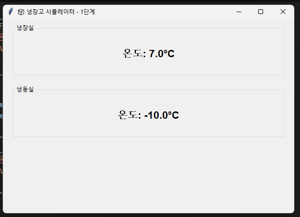
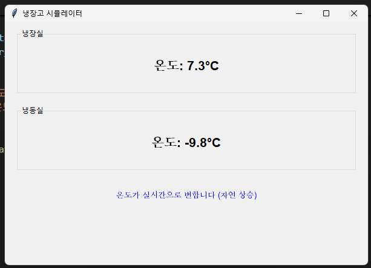

## 🚀 실행 방법

### 필수 라이브러리 설치
```bash
pip install matplotlib
```
(tkinter는 Python 기본 포함)

### 단계별 실행

#### 1단계: 기본 GUI
```bash
python step1_basic.py
```
- 기본 창과 고정된 온도 표시
  


#### 2단계: 실시간 온도 변화
```bash
python step2_temperature.py
```
- 온도가 실시간으로 변함 (자연 상승)



#### 3단계: 자동 제어
```bash
python step3_control.py
```
- 슬라이더로 목표 온도 설정
- 압축기 자동 제어

#### 4단계: 실시간 그래프
```bash
python step4_graph.py
```
- 온도 변화를 그래프로 시각화

#### 5단계: 완전체
```bash
python step5_complete.py
```
- 장애 시뮬레이션 + 로그 시스템

---

## 🧠 핵심 개념

### 1. Hysteresis 제어
```python
# 떨림 방지를 위한 ±2도 범위
if temp > target + 2:
    compressor_on = True   # ON
elif temp < target - 2:
    compressor_on = False  # OFF
# target-2 ~ target+2 사이에서는 상태 유지
```

### 2. 물리 시뮬레이션
```python
# 외부 열 유입 (자연 상승)
fridge_temp += 0.02

# 압축기 작동 (냉각)
if compressor_on:
    freezer_temp -= 0.15
    fridge_temp -= 0.03

# 센서 노이즈
temp += random.gauss(0, 0.05)
```

### 3. 긴급 정지 로직
```python
# 센서 고장 시 즉시 정지
if not sensor_ok:
    compressor_on = False
    damper_open = False
```
