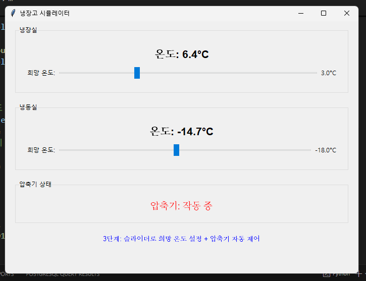
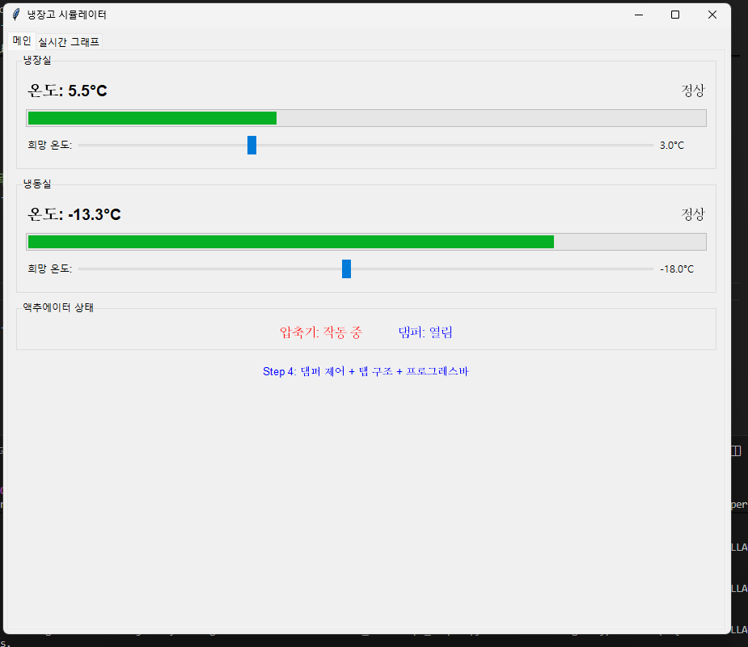
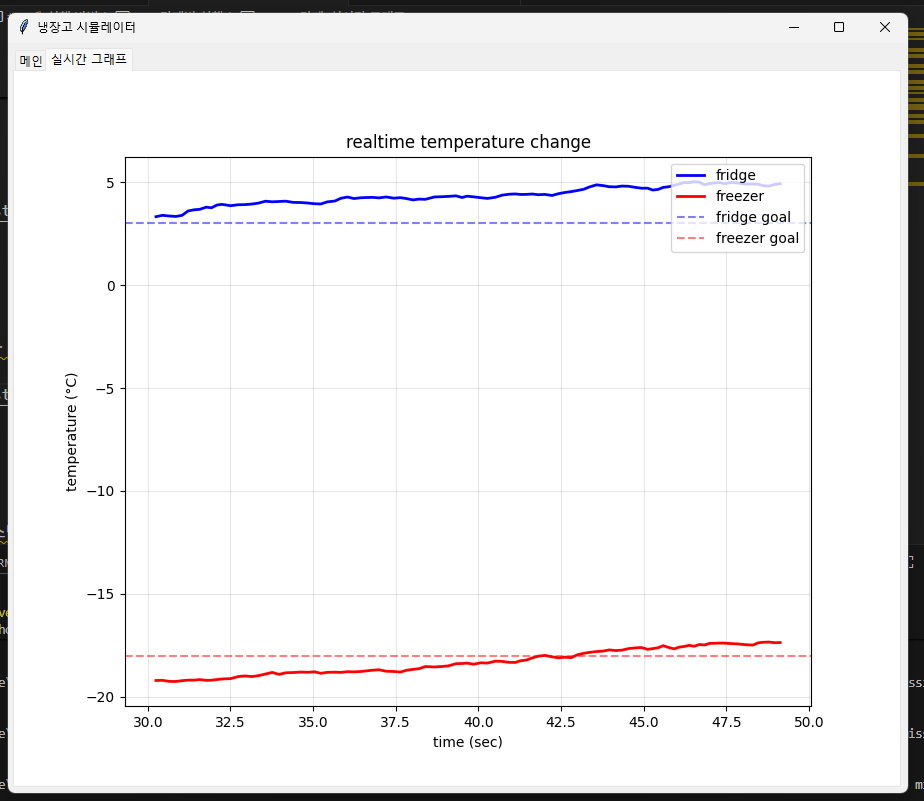
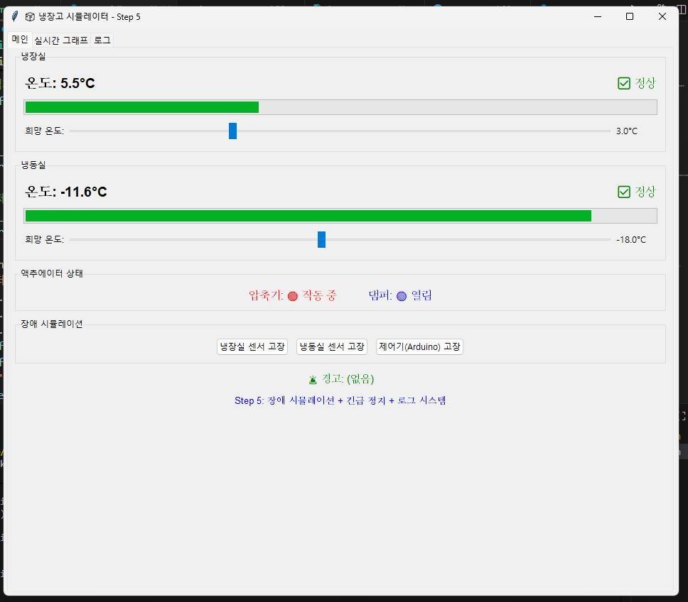
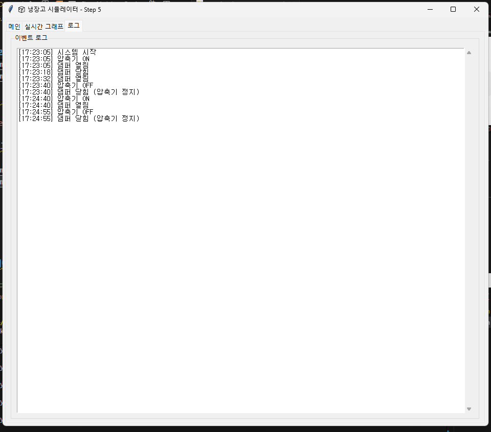
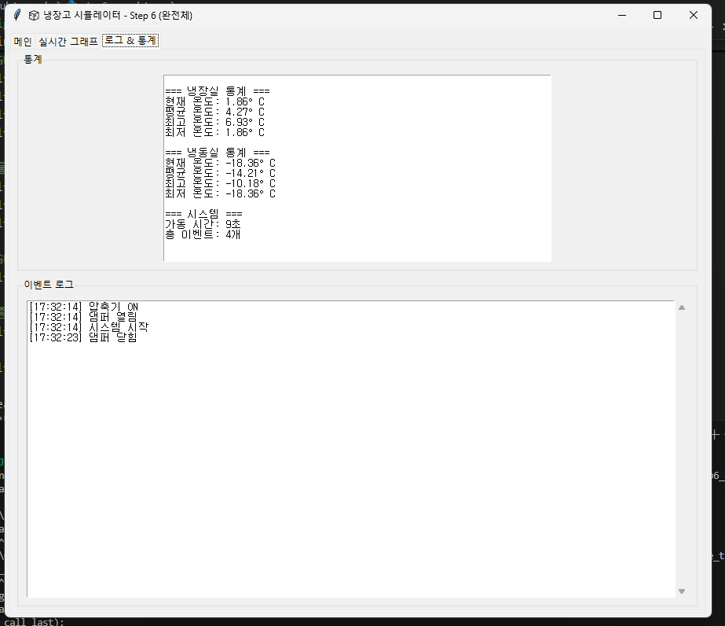

## 🚀 실행 방법

### 필수 라이브러리 설치
```bash
pip install matplotlib
```
(tkinter는 Python 기본 포함)

### 단계별 실행

#### 1단계: 기본 GUI
```bash
python step1_basic.py
```
- 기본 창과 고정된 온도 표시
  


#### 2단계: 실시간 온도 변화
```bash
python step2_temperature.py
```
- 온도가 실시간으로 변함 (자연 상승)


#### 3단계: 자동 제어
```bash
python step3_control.py
```
- 슬라이더로 목표 온도 설정
- 압축기 자동 제어
- 


#### 4단계: 실시간 그래프
```bash
python step4_damper.py
```
- 온도 변화를 그래프로 시각화 및 냉장 냉동 댐퍼 연결
  



#### 5단계: 장치 오류 시뮬레이터 추가
```bash
python step5_failure.py
```
- 장애 시뮬레이션 + 로그 시스템





#### 6단계: 최종 정리 로그 추가
```bash
python step6_complete.py
```




---
